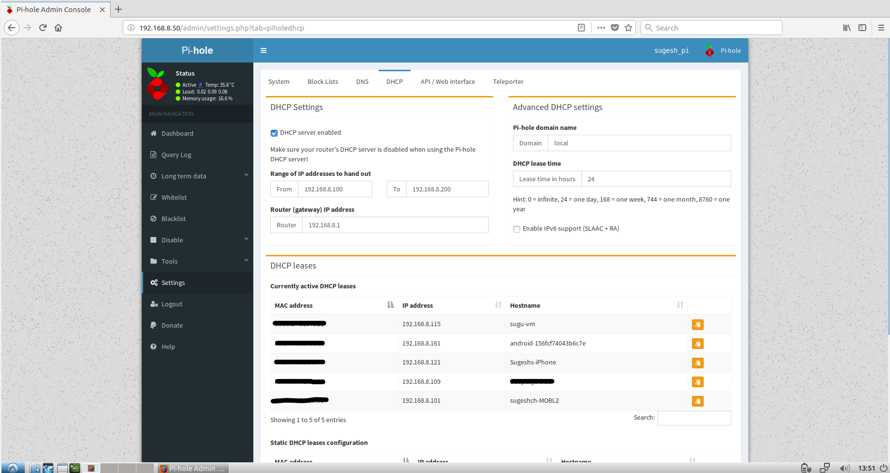

# PI-HOLE over Wi-Fi network.
-----------------------------

## Introduction

Pi-hole is an opensource dns server application that can block the ads in
websites by blocking the dns queries for them.

I use pi-hole at home as a DNS server to filter ad contents and black-list
webistes that are not safe to visit.

## Setup
I have RPi model B lying around in my home, which I used for this project.
The pi-hole can work only when the DNS requests in the network are made to pi-hole application than a global DNS servers such as Google/opendns.

My router at home has very limited functionality as it neither have a ethernet
port nor have support for configuring an external DNS server than default.

To workaround this router limitation, I disabled dhcp in the router completely
and setup pi-hole as the dhcp server too. This will make sure every DNS request
in the network will surely come to pi-hole as its providing the name server details
to the hosts in the network.

Since there are no ethernet port available in the router, I decided to use the
wifi link itself for running pi-hole. This solution helped to hide the pi
somewhere in the corner, out of sight without having any ethernet cables running
around. Neat and clean.. :). Though there are some niggling issues as in known
issues section.

### System configuration.

#### **cpuinfo**

```
    pi@sugesh_pi:~ $ cat /proc/cpuinfo
    processor       : 0
    model name      : ARMv6-compatible processor rev 7 (v6l)
    BogoMIPS        : 697.95
    Features        : half thumb fastmult vfp edsp java tls
    CPU implementer : 0x41
    CPU architecture: 7
    CPU variant     : 0x0
    CPU part        : 0xb76
    CPU revision    : 7

    Hardware        : BCM2835
    Revision        : 0010
    Serial          : 000000009125917d
    pi@sugesh_pi:~ $
```
#### **memory**

```
  pi@sugesh_pi:~ $ cat /proc/meminfo
  MemTotal:         444532 kB
  MemFree:           34848 kB
  MemAvailable:     321392 kB
  Buffers:           43004 kB
  Cached:           293420 kB
  SwapCached:            0 kB
  Active:           175736 kB
  Inactive:         200508 kB
  Active(anon):      40668 kB
  Inactive(anon):    13072 kB
  Active(file):     135068 kB
  Inactive(file):   187436 kB
  Unevictable:           0 kB
  Mlocked:               0 kB
  SwapTotal:        102396 kB
  SwapFree:         102396 kB
  Dirty:                36 kB
  Writeback:             0 kB
  AnonPages:         39832 kB
  Mapped:            36424 kB
  Shmem:             13924 kB
  Slab:              24080 kB
  SReclaimable:      18188 kB
  SUnreclaim:         5892 kB
  KernelStack:         840 kB
  PageTables:         1408 kB
  NFS_Unstable:          0 kB
  Bounce:                0 kB
  WritebackTmp:          0 kB
  CommitLimit:      324660 kB
  Committed_AS:     232756 kB
  VmallocTotal:     573440 kB
  VmallocUsed:           0 kB
  VmallocChunk:          0 kB
  CmaTotal:           8192 kB
  CmaFree:            6808 kB
  pi@sugesh_pi:~ $
```

#### **OS**

```
  pi@sugesh_pi:~ $ lsb_release -a
  No LSB modules are available.
  Distributor ID: Raspbian
  Description:    Raspbian GNU/Linux 9.1 (stretch)
  Release:        9.1
  Codename:       stretch
  pi@sugesh_pi:~ $
```

#### **Disk**
32GB SDcard is being used in the RPi.
```
  pi@sugesh_pi:~ $ fdisk -l
  Device         Boot Start      End  Sectors  Size Id Type
  /dev/mmcblk0p1       8192    93236    85045 41.5M  c W95 FAT32 (LBA)
  /dev/mmcblk0p2      94208 62333951 62239744 29.7G 83 Linux
```

#### **USB**
I use EDIMAX wifi USB adapter on my rpi for wifi connection. The model number
of this wifi dongle is 'Edimax EW-7612U An'

```
  pi@sugesh_pi:~ $ lsusb
  Bus 001 Device 004: ID 7392:7822 Edimax Technology Co., Ltd
  Bus 001 Device 003: ID 0424:ec00 Standard Microsystems Corp. SMSC9512/9514 Fast Ethernet Adapter
  Bus 001 Device 002: ID 0424:9514 Standard Microsystems Corp. SMC9514 Hub
  Bus 001 Device 001: ID 1d6b:0002 Linux Foundation 2.0 root hub
  pi@sugesh_pi:~ $

```

#### **Installation**

* Download the Raspbian stretch lite from the following download location. I
  prefer this raspbian version as it comes with no gui and I wanted to run pi
  in headless mode.

```
  https://www.raspberrypi.org/downloads/raspbian/
```

* We need a img burner software to burn the image to the SD card. There are
  plenty software suites available out there for this, I used etcher here. It works
  on mac, Linux or windows. Its very easy to use and can be downloaded from the
  following location.

```
  https://etcher.io/
```

* extract the downloaded raspbian image. This is an optional step, etcher can
  burn from the zip file itself, I havent tried it though.

```
  unzip 2017-09-07-raspbian-stretch-lite.zip
```

* Burn the extracted image to the SD card using the etcher software.

* Setup the RPi with wifi-dongle, keyboard and monitor for initial configuration.

* Put SD card into raspberrypi and boot it.

* We need to setup the internet connection over wifi first to do the pi-hole
  installation.

  first check if wlan interface is available in pi. If there are no wifi
  interface, its likely that there are issues to bring up the wifi adapter.
  I am not covering those issues here, as its out of scope for this document.
  So now on the assumption is wlan interface is populated as 'wlan0' in the RPi.
  User can verify the available interfaces as below.
  ```
  pi@sugesh_pi:~ $ ip link show
  1: lo: <LOOPBACK,UP,LOWER_UP> mtu 65536 qdisc noqueue state UNKNOWN mode DEFAULT group default qlen 1
    link/loopback 00:00:00:00:00:00 brd 00:00:00:00:00:00
  2: eth0: <NO-CARRIER,BROADCAST,MULTICAST,UP> mtu 1500 qdisc pfifo_fast state DOWN mode DEFAULT group default qlen 1000
    link/ether b8:27:eb:25:91:7d brd ff:ff:ff:ff:ff:ff
  3: wlan0: <BROADCAST,MULTICAST,UP,LOWER_UP> mtu 1500 qdisc mq state UP mode DORMANT group default qlen 1000
    link/ether 74:da:38:25:dd:e5 brd ff:ff:ff:ff:ff:ff
  pi@sugesh_pi:~ $
  ```

  setup the wpa_supplicant file as below.
  ```
    pi@sugesh_pi:~ $ cat /etc/wpa_supplicant/wpa_supplicant.conf
    country=GB
    ctrl_interface=DIR=/var/run/wpa_supplicant GROUP=netdev
    update_config=1
    network={
          ssid="sugesh-nw"
          psk="I-wont-tell-you"
          id_str="home_network"
    }
    pi@sugesh_pi:~ $
  ```

  setup the 'wlan0' interface for networking. use the 'id_str' from above
  configuration to setup network for different wifi access points.

  ```
  pi@sugesh_pi:~ $ cat /etc/network/interfaces
  # interfaces(5) file used by ifup(8) and ifdown(8)

  # Please note that this file is written to be used with dhcpcd
  # For static IP, consult /etc/dhcpcd.conf and 'man dhcpcd.conf'

  # Include files from /etc/network/interfaces.d:
  source-directory /etc/network/interfaces.d
  auto lo
  iface lo inet loopback

  auto eth0
  allow-hotplug eth0
  iface eth0 inet manual

  auto wlan0
  allow-hotplug wlan0
  iface wlan0 inet manual
          wpa-conf /etc/wpa_supplicant/wpa_supplicant.conf
          iface home_network inet manual

  ```
  inet address can have options static, dhcp or manual. User can set a static
  address by using option 'static', 'dhcp' will get ip from dhcp server, where
  as 'manual' let other program to offer the ip address. In this case its
  the 'dhcpcd' program.

* it is noted sometime multiple dhcp client are running in RPi that cause
  interfaces not getting Ip address. To resolve the issue, uninstall all the
  dhcp clients except 'dhcpcd'. Find Installed dhcp clients by using
  `dpkg -l | grep dhcp`.

  uninstall unwanted dhcp client by running `apt purge <dhcp-client>`

* Restart the networking service to make the new changes taken into account.
  ```
  systemctl restart networking.service
  ```
  Wait for few seconds to get the network up with our changes.
  Verify if there are any error to start the networking service. You might get
  logs something like below if service is restarted successfully.

  ```
  pi@sugesh_pi:~ $ systemctl status networking.service
  ● networking.service - Raise network interfaces
   Loaded: loaded (/lib/systemd/system/networking.service; enabled; vendor preset: enabled)
   Active: active (exited) since Sat 2018-02-10 20:17:27 UTC; 17h ago
     Docs: man:interfaces(5)
  Process: 336 ExecStart=/sbin/ifup -a --read-environment (code=exited, status=0/SUCCESS)
  Process: 183 ExecStartPre=/bin/sh -c [ "$CONFIGURE_INTERFACES" != "no" ] && [ -n "$(ifquery --read-environment --list --exclude=lo)" ] && udevadm se
  Main PID: 336 (code=exited, status=0/SUCCESS)
   CGroup: /system.slice/networking.service

  Feb 10 20:17:09 sugesh_pi systemd[1]: Starting Raise network interfaces...
  Feb 10 20:17:18 sugesh_pi ifup[336]: ifup: waiting for lock on /run/network/ifstate.eth0
  Feb 10 20:17:27 sugesh_pi systemd[1]: Started Raise network interfaces.
  ```
  check if dhcpcd is running successfully, if dhcpcd failed to start, its
  likely that some other dhcp client is present in the system.
  ```
  pi@sugesh_pi:~ $ systemctl status dhcpcd.service
  ● dhcpcd.service - dhcpcd on all interfaces
   Loaded: loaded (/lib/systemd/system/dhcpcd.service; enabled; vendor preset: enabled)
  Drop-In: /etc/systemd/system/dhcpcd.service.d
           └─wait.conf
   Active: active (running) since Sat 2018-02-10 20:17:27 UTC; 19h ago
  Process: 196 ExecStart=/usr/lib/dhcpcd5/dhcpcd -q -w (code=exited, status=0/SUCCESS)
  Main PID: 547 (dhcpcd)
    CGroup: /system.slice/dhcpcd.service
           └─547 /sbin/dhcpcd -q -w

  Feb 10 23:04:26 sugesh_pi dhcpcd[547]: wlan0: Router Advertisement from fe80::dac7:71ff:fe59:8963
  Feb 10 23:04:26 sugesh_pi dhcpcd[547]: wlan0: adding address fdd8:c771:5989:6300:3375:b5d4:628b:cea8/64
  Feb 10 23:04:26 sugesh_pi dhcpcd[547]: wlan0: adding route to fdd8:c771:5989:6300::/64
  ```
  Additionally if wifi interface failed to come up, check the 'wpa_supplicant'
  service status as below.

  ```
  pi@sugesh_pi:~ $ systemctl status wpa_supplicant.service
  ● wpa_supplicant.service - WPA supplicant
   Loaded: loaded (/lib/systemd/system/wpa_supplicant.service; disabled; vendor preset: enabled)
   Active: inactive (dead)
  pi@sugesh_pi:~ $

  ```
  check the wlan0 ip to make sure interface is up and working.

  ```
  pi@sugesh_pi:~ $ ip addr show wlan0
  3: wlan0: <BROADCAST,MULTICAST,UP,LOWER_UP> mtu 1500 qdisc mq state UP group default qlen 1000
    link/ether 74:da:38:25:dd:e5 brd ff:ff:ff:ff:ff:ff
    inet 192.168.8.50/24 brd 192.168.8.255 scope global wlan0
       valid_lft forever preferred_lft forever
    inet6 fdd8:c771:5989:6300:3375:b5d4:628b:cea8/64 scope global mngtmpaddr noprefixroute dynamic
       valid_lft 6886sec preferred_lft 3286sec
    inet6 fe80::dfe1:d759:7e97:2f1b/64 scope link
       valid_lft forever preferred_lft forever
  pi@sugesh_pi:~ $
  ```

  As you see, the interface is up with ip 192.168.8.50. So now it good to go
  for installing the pi-hole application.

* Install the pi-hole application using following command. It take a while to
  complete the entire installation.

  ```
    curl -sSL https://install.pi-hole.net | bash
  ```
  Once the installation is complete, take note of router ip address which can
  retrieved with `ip route show |grep default`. Also keep note of the pi-hole
  admin password that created for the specific installation.

* Now pi-hole started running as DNS server in the network that connected to
  wlan0.

* Configure dhcp server in pi-hole.

  As I mentioned before I have a dumbest router ever that doesnt have much
  configuration options available. So I went ahead and disabled the dhcp server
  completely in the router configuration. You can do it in the router web
  interface.Its vary for router to router, hence I am not showing it here.

  I configured dhcp server in the pi-hole application in its web interface as
  below.

  

* Test the pi-hole functions by visiting websites with ad contents. You can
  see the pi-hole stats are getting updated according to the browsing. Enjoy!!


#### Known issues

* RPi showing issues to run dhcp-client. After searching internet for several
  hours it turned out the issues are due to multiple dhcp clients are running in
  the RPi. Make sure there are only one dhcp client running in the system,
  i.e dhcpcd.

* RPi doesnt reconnect to wifi network automatically when it lost connection.
  This limitation is because there are no network manager that monitor the wifi
  connectivity. As a fix I used a script 'wifi-reconnect.sh' to check the
  connectivity to router. This script ping the router ip address to see
  if its reachable. On a event on wifi signal lost, the ip will no longer reachable.
  It causes the script to restart the wifi interface to force the reconnect.

  Add a cron tab entry as below to run this script for every 2 sec.
  ```
  */2 *   * * *   root    /etc/wifi-reconnect.sh
  ```

  Please make sure the script is stored under '/etc/'.  Also do not forget to
  update the router ip address inside the script.

* Restarting wifi interface causing to taint the wifi kernel. On each
  wifi network interface reset creating following logs in syslog. I dont see
  any impact with this error, however its worth to know. There is already a bug
  in raspbian to track this issue.

  ```
  [ 9803.452227] ------------[ cut here ]------------
  [ 9803.453263] WARNING: CPU: 0 PID: 6 at net/wireless/sme.c:948 __cfg80211_disconnected+0x32c/0x378 [cfg80211]
  [ 9803.453278] Modules linked in: binfmt_misc 8192cu cfg80211 rfkill snd_bcm2835 snd_pcm snd_timer snd bcm2835_gpiomem uio_pdrv_genirq fixed uio ip_tables x_tables ipv6
  [ 9803.453360] CPU: 0 PID: 6 Comm: kworker/u2:0 Tainted: G        W       4.9.59+ #1047
  [ 9803.453366] Hardware name: BCM2835
  [ 9803.454173] Workqueue: cfg80211 cfg80211_event_work [cfg80211]
  [ 9803.454249] [<c0016148>] (unwind_backtrace) from [<c0013c90>] (show_stack+0x20/0x24)
  [ 9803.454278] [<c0013c90>] (show_stack) from [<c031a618>] (dump_stack+0x20/0x28)
  [ 9803.454305] [<c031a618>] (dump_stack) from [<c0021d1c>] (__warn+0xe4/0x10c)
  [ 9803.454326] [<c0021d1c>] (__warn) from [<c0021e10>] (warn_slowpath_null+0x30/0x38)
  [ 9803.455154] [<c0021e10>] (warn_slowpath_null) from [<bf12f320>] (__cfg80211_disconnected+0x32c/0x378 [cfg80211])
  [ 9803.456644] [<bf12f320>] (__cfg80211_disconnected [cfg80211]) from [<bf1086bc>] (cfg80211_process_wdev_events+0x1a4/0x210 [cfg80211])
  [ 9803.458137] [<bf1086bc>] (cfg80211_process_wdev_events [cfg80211]) from [<bf108764>] (cfg80211_process_rdev_events+0x3c/0x74 [cfg80211])
  [ 9803.459799] [<bf108764>] (cfg80211_process_rdev_events [cfg80211]) from [<bf103208>] (cfg80211_event_work+0x24/0x2c [cfg80211])
  [ 9803.460941] [<bf103208>] (cfg80211_event_work [cfg80211]) from [<c0038b3c>] (process_one_work+0x11c/0x398)
  [ 9803.460981] [<c0038b3c>] (process_one_work) from [<c0038df4>] (worker_thread+0x3c/0x508)
  [ 9803.461009] [<c0038df4>] (worker_thread) from [<c003e954>] (kthread+0xf8/0x114)
  [ 9803.461040] [<c003e954>] (kthread) from [<c000fec8>] (ret_from_fork+0x14/0x2c)
  [ 9803.461051] ---[ end trace c6aaea9f961b95c9 ]---

  ```
